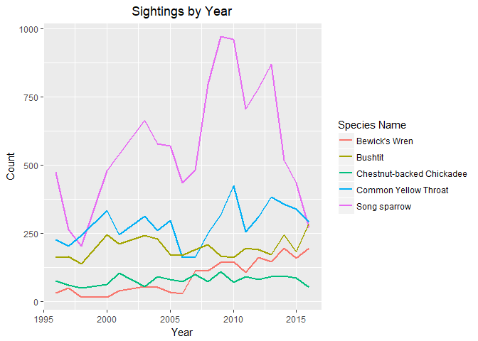
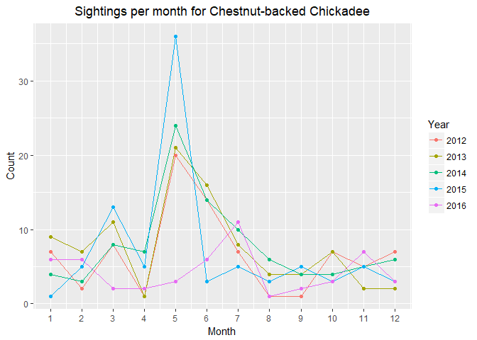

Final Project Report
================
Data Knights
December 06, 2018

-   [Data Cleaning Documentation](#data-cleaning-documentation)
    -   [Description of the Data Source](#description-of-the-data-source)
    -   [Intellectual Policy Constraints](#intellectual-policy-constraints)
    -   [Description of the Meta Data](#description-of-the-meta-data)
    -   [Issues Encountered within the Data](#issues-encountered-within-the-data)
    -   [Data Remediation](#data-remediation)
    -   [R Syntax with Step-by-Step Description](#r-syntax-with-step-by-step-description)
-   [R Scripts](#r-scripts)
-   [R Plots with Description](#r-plots-with-description)
    -   [Research Questions](#research-questions)
    -   [Change in the Sex Ratio of Different species over the years](#change-in-the-sex-ratio-of-different-species-over-the-years)
    -   [Number of Sightings of different species over the years](#number-of-sightings-of-different-species-over-the-years)
    -   [Number of Sightings of different Species by month over the span of 5 years](#number-of-sightings-of-different-species-by-month-over-the-span-of-5-years)
    -   [Change in the average weight of each species over the span of 20 years](#change-in-the-average-weight-of-each-species-over-the-span-of-20-years)
    -   [Change in the average weight of each species by month over the span of 5 years](#change-in-the-average-weight-of-each-species-by-month-over-the-span-of-5-years)
    -   [Change in the average Wing to Weight Ratio of each species over the span of 20 years](#change-in-the-average-wing-to-weight-ratio-of-each-species-over-the-span-of-20-years)
    -   [Change in the average Wing to Weight Ratio of each species by month over the span of 5 years](#change-in-the-average-wing-to-weight-ratio-of-each-species-by-month-over-the-span-of-5-years)
-   [Contributorship Statement](#contributorship-statement)
-   [Proofreader](#proofreader)

------------------------------------------------------------------------

Data Cleaning Documentation
===========================

Description of the Data Source
------------------------------

The Data set consists of Bird Banding Data at Coyote Creek Field Station (CCFS) over the span of 20 years from 1996 to 2016. It consists of information such as Banding Number which is a unique number given to each bird, the different capture dates of the birds and various demographic details about the birds captured at CCFS. There are total 78642 records collected and each record contains 25 columns. There are a total of 1154 species of Birds in the Data set, we are planning to consider the data of 2 species which are of interest to the client. Some of the important columns which we are considering for our analysis are as follows:

-   Band Number
-   Capture Date
-   First Capture Date
-   Last Capture Date
-   Capture Type
-   Species Code
-   Age
-   Sex
-   Trapsite
-   Fat
-   BroodPatch
-   CloacalProtuberance
-   WingMolt
-   PrimaryWear
-   WingLength
-   Weight

We have access to supporting Meta Data Files files which help us understanding certain Codes within the main Data set. We also have a Data set indicating the Trap hours i.e. the operating hours of the trap sites over the past 20 years.

Intellectual Policy Constraints
-------------------------------

The CCFS Bird Banding Dataset is owned by San Fransisco Bay Bird Observatory and we have been granted the permission to maintain an electronic copy of this dataset for analysis. This Data set can be uploaded to a publicly accessible repository on GitHub for collaborative data analysis purposes but should not be made available for use by third parties. SFBBO reserves the right to request that these data be moved into a private repository on GitHub at any time.

The results of the analysis can be used for inclusion in a professional portfolio but should not be published in any popular article or scientific manuscript without the permission of SFBBO. The data must be removed from all the sources upon the termination of the Data Sharing Agreement. This agreement is valid for the duration of the course, "From Data to Decisions".

Note: All this information has been fully extracted from the "Data Sharing Agreement".

Description of the Meta Data
----------------------------

This is a complete Bird Banding Data at CCFS over the past 20 years.The dataset contains various details collected when a bird is trapped in one of the trap sites. Meta Data about various fields is as follows:

-   **Band Number** is the a unique number given to each bird when they are first captured. It helps to identify each bird uniquely.<br/>
-   **Capture Date** is the date on which the bird was captured **First Captured Date** and **Last Captured Date** gives the first and last encounter date for the individual bird. **Capture Type** enables us to know if it is a newly captured bird or a returning bird. <br/>
-   **Species Code** is a unique code given to each species. (We are planning to replace this field with species name to avoid any confusion) <br/>
-   **Trap site** gives us the details about the site in which the bird was captured.
-   **Age**, **Sex**, **Fat**, **Weight** gives us the details of age, sex, fat stored in the furcular hollow of the birds body and Mass of the bird in grams respectively.<br/>
-   **BroodPatch** and **CloacalProtuberance** are the female and male breeding characteristics respectively. <br/>
-   **WingMolt** identifies molting feathers in the wing and tail of the bird.<br/>
-   **PrimaryWear** is the amount of wear in the wing feather tips.<br/>
-   **WingLength** is the length of the wing of the bird when captured in millimeters.

Issues Encountered within the Data
----------------------------------

From our Bird Banding data, we are using the "Data Banding Records" sheet for our data analysis. This data sheet has some missing values that we have eliminated in our data cleaning process. The data sheet has data from 1996-2016 and the data from 1999, 2002 has majority of the missing values as well as less data compared to the data from other years. So, for our analysis we will not be considering the data from the years 1999 and 2002.

According to our client, they are more interested in two specific species. Since the variety of species in the client's data is extremely vast, for our analysis we will use the two species mentioned by our client and if possible we will add a few more species later. The two species mentioned by our client are **Song Sparrow** and **Common Yellowthroat**. So, the data for other species will not be considered during our analysis. We also removed some columns that we do not need for our analysis and we will replace the shortforms or codes with their original names using the information from the given metadata sheets.

Major issues include:

-   Both 1999 and 2002 have missing records in the beginning of each year.
-   The coded values are too granular, which causes small n-sizes and uneven categories.
-   R natively reads the "-" character instead of classifying as NA.
-   Several records from the weight column appear to be data entry errors with many standard deviations above sample norms.
-   Many of the bird attributes have missing data in the earlier years.

Data Remediation
----------------

Both 1999 and 2002 were removed, because our analysis will rely heavily on seasonal trends, which would be impacted by the months of missing data in these years. Attributes were recoded to either two or three categories, which helps sample sizes for trend analysis and future visual encoding decisions with fewer color representations. Weight observations that appeared to be data entry errors were replaced with NA. NA values were reentered into the data where the dash character was found. These data records were not removed, because the main frequency metrics and trends were not impacted by this issue.

R Syntax with Step-by-Step Description
--------------------------------------

1.  Remove meta tab and transform Excel files into .csv files (Completed outside of R)
    -   Metadata Trap.xlsx changes to habitat.csv
    -   Data BandingRecords 1996-2016.xslx changes to BandingRecords

2.  Read two data files

    ``` r
    habitat <- read.csv("C:/Users/ramas/Documents/ISQA 8086/Final git/habitat.csv")
    BandingRecords <- read.csv("C:/Users/ramas/Documents/ISQA 8086/Final git/BandingRecords.csv")
    ```

3.  Remove unneeded columns

    ``` r
    FilterVariables <- subset(BandingRecords, select=c("RowID","SpeciesCode", "BandNumber","CaptureDate","FirstCaptureDate","LastCaptureDate", "CaptureType","Age", "Sex", "TrapSite", "Fat", "BroodPatch", "CloacalProtuberance", "WingMolt", "PrimaryWear", "WingLength", "Weight"))
    ```

4.  Split date column

    ``` r
    dateBlock <- unlist(strsplit(as.character(FilterVariables$CaptureDate),"-"))
    ```

5.  Create year column

    ``` r
    yearBlock <- dateBlock[seq(3,length(dateBlock),3)]
    yearBlockClean <- substr(yearBlock,3,4)
    FilterVariables$year <- yearBlockClean
    ```

6.  Create month column

    ``` r
    monthBlock <- dateBlock[seq(2,length(dateBlock),3)]
    FilterVariables$month <- monthBlock
    ```

7.  Filter out years 1999 and 2002 due to incomplete data

    ``` r
    FilterData <- FilterVariables[FilterVariables$year != "99",]
    FilterData <- FilterData[FilterData$year != "02",]
    ```

8.  Create new data frame for recoding

    ``` r
    CleanedBirdData <- FilterData
    ```

9.  Create sosp column

    ``` r
    CleanedBirdData$sosp[CleanedBirdData$SpeciesCode == "SOSP"] <- 1
    CleanedBirdData$sosp[is.na(CleanedBirdData$sosp)] <- 0
    ```

10. Create coye column

    ``` r
    CleanedBirdData$coye[CleanedBirdData$SpeciesCode == "COYE"] <- 1
    CleanedBirdData$coye[is.na(CleanedBirdData$coye)] <- 0
    ```

11. Create ageRecode column with recoded values

    ``` r
    CleanedBirdData$ageRecode[CleanedBirdData$Age == 2] <- 0
    CleanedBirdData$ageRecode[CleanedBirdData$Age == 1] <- 1
    CleanedBirdData$ageRecode[CleanedBirdData$Age > 4] <- 1
    ```

12. Create sexRecode column with recoded values

    ``` r
    CleanedBirdData$sexRecode[CleanedBirdData$Sex == "M"] <- 1
    CleanedBirdData$sexRecode[CleanedBirdData$Sex == "F"] <- 0
    ```

13. Create fatRecode column with recoded values

    ``` r
    CleanedBirdData$fatRecode[CleanedBirdData$Fat == "0"] <- 0
    CleanedBirdData$fatRecode[CleanedBirdData$Fat == "1"] <- 1
    CleanedBirdData$fatRecode[CleanedBirdData$Fat == "2"] <- 1
    CleanedBirdData$fatRecode[CleanedBirdData$Fat == "3"] <- 2
    CleanedBirdData$fatRecode[CleanedBirdData$Fat == "4"] <- 2
    CleanedBirdData$fatRecode[CleanedBirdData$Fat == "5"] <- 2
    CleanedBirdData$fatRecode[CleanedBirdData$Fat == "6"] <- 2
    CleanedBirdData$fatRecode[CleanedBirdData$Fat == "7"] <- 2
    ```

14. Create broodRecode column with recoded values

    ``` r
    CleanedBirdData$broodRecode[CleanedBirdData$BroodPatch == "0"] <- 0
    CleanedBirdData$broodRecode[is.na(CleanedBirdData$broodRecode)] <- 1
    CleanedBirdData$broodRecode[CleanedBirdData$BroodPatch == "-"] <- NA
    ```

15. Create cloacalRecode with recoded values

    ``` r
    CleanedBirdData$cloacalRecode[CleanedBirdData$CloacalProtuberance == "0"] <- 0
    CleanedBirdData$cloacalRecode[is.na(CleanedBirdData$cloacalRecode)] <- 1
    CleanedBirdData$cloacalRecode[CleanedBirdData$CloacalProtuberance == "-"] <- NA
    ```

16. Create moltRecode with recoded values

    ``` r
    CleanedBirdData$moltRecode[CleanedBirdData$WingMolt == "0"] <- 0
    CleanedBirdData$moltRecode[CleanedBirdData$WingMolt == "S"] <- 1
    CleanedBirdData$moltRecode[CleanedBirdData$WingMolt == "A"] <- 1
    ```

17. Create wearRecode with recoded values

    ``` r
    CleanedBirdData$wearRecode[CleanedBirdData$PrimaryWear == "0"] <- 0
    CleanedBirdData$wearRecode[CleanedBirdData$PrimaryWear == "1"] <- 1
    CleanedBirdData$wearRecode[CleanedBirdData$PrimaryWear == "2"] <- 1
    CleanedBirdData$wearRecode[CleanedBirdData$PrimaryWear == "3"] <- 2
    CleanedBirdData$wearRecode[CleanedBirdData$PrimaryWear == "4"] <- 2
    CleanedBirdData$wearRecode[CleanedBirdData$PrimaryWear == "5"] <- 2
    ```

18. Remove replace SOSP weight outliers with NA

    ``` r
    CleanedBirdData$cleanWeight[CleanedBirdData$Weight > 40 & CleanedBirdData$SpeciesCode == "SOSP"] <- NA
    ```

19. Create wingToWeightRatio Column

    ``` r
    CleanedBirdData$wingToWeightRatio <- CleanedBirdData$WingLength / CleanedBirdData$cleanWeight
    ```

20. Left join BandingData and Habitat on TrapSite

    ``` r
    fullData <- merge(x = CleanedBirdData, y = habitat, by = "TrapSite", all.x = TRUE)
    ```

21. Remove unnecessary columns from the Habitat file

    ``` r
    FullDataFilter <- subset(fullData, select=c("RowID.x","SpeciesCode", "BandNumber","CaptureDate","FirstCaptureDate","LastCaptureDate", "CaptureType","Age", "Sex", "TrapSite", "Fat", "BroodPatch", "CloacalProtuberance", "WingMolt", "PrimaryWear", "WingLength", "Weight", "year", "month", "sosp", "coye", "ageRecode", "sexRecode", "fatRecode", "broodRecode", "cloacalRecode", "moltRecode", "wearRecode", "cleanWeight", "wingToWeightRatio", "Habitat"))
    ```

22. (Optional) If desired, remove all observations with at least one null value

    ``` r
    FullDataRemoveNA <- FullDataFilter[complete.cases(FullDataFilter), ]
    ```

R Scripts
=========

1.  The Dataset used for these Scripts was generated during the Data Cleaning process from the original Dataset belonging to Coyote Creek Field Station. Some of the cleaning steps done include:
    -   The name of the cleaned Dataset used is cleanData.csv
    -   The Date Field was split into months, years during Data Cleaning for performing data analysis.
    -   The Data from years 1999 and 2002 was deleted due to incomplete data.
    -   Weight outliers have been set to N/A.
    -   Created a new column called "wingToWeightRatio" to perform some analyses.

2.  Creating Subset Dataframes for each of the 5 Species.

    ``` r
    # subset for Common Yellowthroat
    coye <- subset(BandingData, SpeciesCode=="COYE")

    # subset for Song Sparrow
    sosp <- subset(BandingData, SpeciesCode=="SOSP")

    # subset for Bewick's Wren 
    bewr <- subset(BandingData, SpeciesCode=="BEWR")

    # subset for Bushtit 
    bush <- subset(BandingData, SpeciesCode=="BUSH")

    # subset for Chestnut-backed Chickadee 
    cbch <- subset(BandingData, SpeciesCode=="CBCH")
    ```

3.  Summary Statistics for Weight of each species.

    ``` r
    # summary statistics for weight for Common Yellowthroat
    summary(coye$cleanWeight)
    ```

        ##    Min. 1st Qu.  Median    Mean 3rd Qu.    Max. 
        ##   4.500   8.800   9.300   9.328   9.700  19.000

    ``` r
    # summary statistics for weight for Song Sparrow
    summary(sosp$cleanWeight)
    ```

        ##    Min. 1st Qu.  Median    Mean 3rd Qu.    Max.    NA's 
        ##   11.10   16.80   17.70   17.71   18.60   28.80       3

    ``` r
    # summary statistics for weight for Bewick's Wren
    summary(bewr$cleanWeight)
    ```

        ##    Min. 1st Qu.  Median    Mean 3rd Qu.    Max. 
        ##   6.000   9.200   9.500   9.543   9.900  16.800

    ``` r
    # summary statistics for weight for Bushtit
    summary(bush$cleanWeight)
    ```

        ##    Min. 1st Qu.  Median    Mean 3rd Qu.    Max. 
        ##   3.300   5.200   5.400   5.434   5.600  55.000

    ``` r
    # summary statistics for weight for Chestnut-backed Chickadee
    summary(cbch$cleanWeight)
    ```

        ##    Min. 1st Qu.  Median    Mean 3rd Qu.    Max. 
        ##   5.600   9.000   9.400   9.404   9.800  19.200

4.  Summary statistics for Wing to Weight Ratio for each species.

    ``` r
    # summary statistics for Wing to Weight Ratio for each Common Yellowthroat
    summary(coye$wingToWeightRatio)
    ```

        ##    Min. 1st Qu.  Median    Mean 3rd Qu.    Max. 
        ##   2.910   5.484   5.745   5.720   5.978  15.636

    ``` r
    # summary statistics for Wing to Weight Ratio for each Song Sparrow
    summary(sosp$wingToWeightRatio)
    ```

        ##    Min. 1st Qu.  Median    Mean 3rd Qu.    Max.    NA's 
        ##   2.118   3.149   3.280   3.286   3.427   4.955       3

    ``` r
    # summary statistics for Wing to Weight Ratio for each Bewick's Wren
    summary(bewr$wingToWeightRatio)
    ```

        ##    Min. 1st Qu.  Median    Mean 3rd Qu.    Max. 
        ##   3.101   5.102   5.269   5.268   5.444   8.167

    ``` r
    # summary statistics for Wing to Weight Ratio for each Bushtit
    summary(bush$wingToWeightRatio)
    ```

        ##    Min. 1st Qu.  Median    Mean 3rd Qu.    Max. 
        ##  0.8704  8.3636  8.6538  8.6089  8.8889 14.8485

    ``` r
    # summary statistics for Wing to Weight Ratio for each Chestnut-backed Chickadee
    summary(cbch$wingToWeightRatio)
    ```

        ##    Min. 1st Qu.  Median    Mean 3rd Qu.    Max. 
        ##   2.969   6.100   6.302   6.303   6.517  10.179

5.  Count of each species of Bird sighted in different Habitats over the span of 20 years.

    ``` r
    library(plyr)
    ```

        ## Warning: package 'plyr' was built under R version 3.4.3

    ``` r
    # Song Sparrow
    count(sosp,c('Habitat'))
    ```

        ##             Habitat freq
        ## 1 1987 Revegetation 1924
        ## 2  1993 Revegtation 2762
        ## 3   Mature Riparian 2126
        ## 4  Overflow Channel 4185

    ``` r
    # Common Yellowthroat
    count(coye,c('Habitat'))
    ```

        ##             Habitat freq
        ## 1 1987 Revegetation  766
        ## 2  1993 Revegtation  998
        ## 3   Mature Riparian  327
        ## 4  Overflow Channel 3275

    ``` r
    # Bewick's Wren
    count(bewr,c('Habitat'))
    ```

        ##             Habitat freq
        ## 1 1987 Revegetation  381
        ## 2  1993 Revegtation  717
        ## 3   Mature Riparian  380
        ## 4  Overflow Channel  325

    ``` r
    # Bushtit
    count(bush,c('Habitat'))
    ```

        ##             Habitat freq
        ## 1 1987 Revegetation  604
        ## 2  1993 Revegtation  961
        ## 3   Mature Riparian  382
        ## 4  Overflow Channel 1785

    ``` r
    # Chestnut-backed Chickadee
    count(cbch,c('Habitat'))
    ```

        ##             Habitat freq
        ## 1 1987 Revegetation  450
        ## 2  1993 Revegtation  226
        ## 3   Mature Riparian  592
        ## 4  Overflow Channel  238

6.  Count of each species of Bird sighted in different Trapsites over the span of 20 years.

    ``` r
    # Number of Birds sighted in different Trapsites
    count(sosp,c('TrapSite')) # Song Sparrow
    count(coye,c('TrapSite')) # Common Yellowthroat
    count(bewr,c('TrapSite')) # Bewick's Wren
    count(bush,c('TrapSite')) # Bushtit
    count(cbch,c('TrapSite')) # Chestnut-backed Chickadee

    # Output not displayed because its too lengthy
    ```

7.  Number of Male and Female birds spotted every year.

    ``` r
    # Number of Male and Female birds spotted every year
    count(sosp,c('year','sexRatio')) # Song Sparrow
    count(coye,c('year','sexRatio')) # Common Yellowthroat
    count(bewr,c('year','sexRatio')) # Bewick's Wren
    count(bush,c('year','sexRatio')) # Bushtit
    count(cbch,c('year','sexRatio')) # Chestnut-backed Chickadee

    # Output not displayed because its too lengthy
    ```

8.  Number of birds sighted per month in each year.

    ``` r
    count_sosp = count(sosp, c('month','year')) # Song Sparrow
    count_coye = count(coye, c('month','year')) # Common Yellowthroat
    count_bewr = count(bewr, c('month','year')) # Bewick's Wren
    count_bush = count(bush, c('month','year')) # Bushtit
    count_cbch = count(cbch, c('month','year')) # Chestnut-backed Chickadee

    # Output not displayed because its too lengthy
    ```

9.  Number of birds sighted in each year.

    ``` r
    count_coye_year = count(coye, c('year')) # Common Yellowthroat
    count_sosp_year = count(sosp, c('year')) # Song Sparrow
    count_bewr_year = count(bewr, c('year')) # Bewick's Wren
    count_bush_year = count(bush, c('year')) # Bushtit
    count_cbch_year = count(cbch, c('year')) # Chestnut-backed Chickadee

    # Displaying just the output for Common Yellowthroat
    count_coye_year
    ```

        ##    year freq
        ## 1     0  334
        ## 2     1  244
        ## 3     3  313
        ## 4     4  260
        ## 5     5  296
        ## 6     6  161
        ## 7     7  162
        ## 8     8  249
        ## 9     9  318
        ## 10   10  425
        ## 11   11  254
        ## 12   12  309
        ## 13   13  383
        ## 14   14  357
        ## 15   15  339
        ## 16   16  292
        ## 17   96  226
        ## 18   97  202
        ## 19   98  242

10. Mean of weights by month for each year for Common Yellowthroat. (Means for remaining species can be found in R script)

    ``` r
    #mean of weights by month for each year for Common Yellowthroat
    coye_mean = data.frame()

    for ( yr in unique(coye$year) )
    {
      for ( mn in unique(coye$month) )
      {
        tmp = subset(coye, year==yr & month==mn)
        mean = mean(tmp$cleanWeight, na.rm=TRUE)
        coye_mean = rbind(coye_mean, data.frame(yr,mn, mean))
      }
    }

    coye_mean <- coye_mean[with(coye_mean, order(mn,yr)), ]
    ```

11. Mean of wing to weight ratio by month for each year for Common Yellowthroat. (Means for remaining species can be found in R script)

    ``` r
    #mean of wing to weight by month for each year for Common Yellowthroat
    coye_wtow_mean = data.frame()

    for ( yr in unique(coye$year) )
    {
      for ( mn in unique(coye$month) )
      {
        tmp5 = subset(coye, year==yr & month==mn)
        mean_c_wtow = mean(tmp5$wingToWeightRatio)
        coye_wtow_mean = rbind(coye_wtow_mean, data.frame(yr,mn, mean_c_wtow))
      }
    }

    coye_wtow_mean <- coye_wtow_mean[with(coye_wtow_mean, order(mn,yr)), ]
    ```

12. Summary statistics for weight per month. (months of all years combined)

    ``` r
    detach(package:plyr)
    library(dplyr)
    ```

        ## Warning: package 'dplyr' was built under R version 3.4.4

        ## 
        ## Attaching package: 'dplyr'

        ## The following objects are masked from 'package:stats':
        ## 
        ##     filter, lag

        ## The following objects are masked from 'package:base':
        ## 
        ##     intersect, setdiff, setequal, union

    ``` r
    #summary statistics for weight based on months for Common Yellowthroat
    coye%>%
      group_by(month)%>% 
      summarise(Mean=mean(cleanWeight, na.rm=TRUE),Max=max(cleanWeight, na.rm=TRUE), Min=min(cleanWeight, na.rm=TRUE), Median=median(cleanWeight, na.rm=TRUE), Std=sd(cleanWeight, na.rm=TRUE))
    ```

        ## Warning: package 'bindrcpp' was built under R version 3.4.4

        ## # A tibble: 12 x 6
        ##    month  Mean   Max   Min Median   Std
        ##    <int> <dbl> <dbl> <dbl>  <dbl> <dbl>
        ##  1     1  9.07  10.7   7.6   9.05 0.628
        ##  2     2  8.91  10.5   7.5   8.9  0.522
        ##  3     3  9.33  13.7   7.9   9.2  0.762
        ##  4     4  9.70  12.5   7.2   9.6  0.768
        ##  5     5  9.53  19     4.5   9.5  0.810
        ##  6     6  9.29  18.9   7.4   9.3  0.688
        ##  7     7  9.31  15.6   7.6   9.3  0.698
        ##  8     8  9.08  12.8   7.6   9    0.618
        ##  9     9  9.29  15.4   5.5   9.1  0.975
        ## 10    10  9.23  13.6   7.6   9    1.03 
        ## 11    11  8.9   12.3   7.3   8.9  0.670
        ## 12    12  9.02  11.5   7.9   9    0.717

    ``` r
    #summary statistics for weight based on months for Song Sparrow
    sosp%>%
      group_by(month)%>% 
      summarise(Mean=mean(cleanWeight, na.rm=TRUE),Max=max(cleanWeight, na.rm=TRUE), Min=min(cleanWeight, na.rm=TRUE), Median=median(cleanWeight, na.rm=TRUE), Std=sd(cleanWeight, na.rm=TRUE))

    #summary statistics for weight based on months for Bewick's Wren
    bewr%>%
      group_by(month)%>% 
      summarise(Mean=mean(cleanWeight, na.rm=TRUE),Max=max(cleanWeight, na.rm=TRUE), Min=min(cleanWeight, na.rm=TRUE), Median=median(cleanWeight, na.rm=TRUE), Std=sd(cleanWeight, na.rm=TRUE))

    #summary statistics for weight based on months for Bushtit
    bush%>%
      group_by(month)%>% 
      summarise(Mean=mean(cleanWeight, na.rm=TRUE),Max=max(cleanWeight, na.rm=TRUE), Min=min(cleanWeight, na.rm=TRUE), Median=median(cleanWeight, na.rm=TRUE), Std=sd(cleanWeight, na.rm=TRUE))

    #summary statistics for weight based on months for Chestnut-backed Chickadee
    cbch%>%
      group_by(month)%>% 
      summarise(Mean=mean(cleanWeight, na.rm=TRUE),Max=max(cleanWeight, na.rm=TRUE), Min=min(cleanWeight, na.rm=TRUE), Median=median(cleanWeight, na.rm=TRUE), Std=sd(cleanWeight, na.rm=TRUE))
    ```

13. Summary statistics for weight per year.

    ``` r
    detach(package:plyr)
    library(dplyr)
    #summary statistics for weight based on years for Common Yellowthroat
    coye%>%
      group_by(year)%>% 
      summarise(Mean=mean(cleanWeight, na.rm=TRUE),Max=max(cleanWeight, na.rm=TRUE), Min=min(cleanWeight, na.rm=TRUE), Median=median(cleanWeight, na.rm=TRUE), Std=sd(cleanWeight, na.rm=TRUE))
    ```

        ## # A tibble: 19 x 6
        ##     year  Mean   Max   Min Median   Std
        ##    <int> <dbl> <dbl> <dbl>  <dbl> <dbl>
        ##  1     0  9.33  12.7   7.7   9.3  0.771
        ##  2     1  9.42  15.2   7.7   9.25 0.949
        ##  3     3  9.29  12.1   7.9   9.2  0.715
        ##  4     4  9.36  19     7.4   9.3  1.02 
        ##  5     5  9.39  16.2   8     9.3  0.824
        ##  6     6  9.28  11.7   7.5   9.3  0.643
        ##  7     7  9.36  15.1   7.6   9.3  0.831
        ##  8     8  9.20  12.5   7.4   9.2  0.658
        ##  9     9  9.34  13     7.7   9.3  0.761
        ## 10    10  9.37  15.6   7.7   9.4  0.771
        ## 11    11  9.30  12.9   7.6   9.2  0.683
        ## 12    12  9.31  13     7.2   9.3  0.706
        ## 13    13  9.20  12.9   7.3   9.2  0.693
        ## 14    14  9.24  11.8   7.5   9.2  0.679
        ## 15    15  9.29  12.2   7.7   9.3  0.667
        ## 16    16  9.17  11.3   7.6   9.2  0.589
        ## 17    96  9.38  11.6   4.5   9.3  0.834
        ## 18    97  9.61  13.6   5.5   9.35 1.01 
        ## 19    98  9.57  18.9   7.6   9.4  1.24

    ``` r
    #summary statistics for weight based on years for Song Sparrow
    sosp%>%
      group_by(year)%>% 
      summarise(Mean=mean(cleanWeight, na.rm=TRUE),Max=max(cleanWeight, na.rm=TRUE), Min=min(cleanWeight, na.rm=TRUE), Median=median(cleanWeight, na.rm=TRUE), Std=sd(cleanWeight, na.rm=TRUE))

    #summary statistics for weight based on years for Bewick's Wren
    bewr%>%
      group_by(year)%>% 
      summarise(Mean=mean(cleanWeight, na.rm=TRUE),Max=max(cleanWeight, na.rm=TRUE), Min=min(cleanWeight, na.rm=TRUE), Median=median(cleanWeight, na.rm=TRUE), Std=sd(cleanWeight, na.rm=TRUE))

    #summary statistics for weight based on years for Bushtitbush
    bush%>%
      group_by(year)%>% 
      summarise(Mean=mean(cleanWeight, na.rm=TRUE),Max=max(cleanWeight, na.rm=TRUE), Min=min(cleanWeight, na.rm=TRUE), Median=median(cleanWeight, na.rm=TRUE), Std=sd(cleanWeight, na.rm=TRUE))

    #summary statistics for weight based on years for Chestnut-backed Chickadee
    cbch%>%
      group_by(year)%>% 
      summarise(Mean=mean(cleanWeight, na.rm=TRUE),Max=max(cleanWeight, na.rm=TRUE), Min=min(cleanWeight, na.rm=TRUE), Median=median(cleanWeight, na.rm=TRUE), Std=sd(cleanWeight, na.rm=TRUE))
    ```

14. Summary statistics for Wing to Weight Ratio per month. (months of all years combined)

    ``` r
    detach(package:plyr)
    library(dplyr)
    #summary statistics based on months for Common Yellowthroat for wingtoweight ratio
    coye%>%
      group_by(month)%>% 
      summarise(Mean=mean(wingToWeightRatio, na.rm=TRUE),Max=max(wingToWeightRatio, na.rm=TRUE), Min=min(wingToWeightRatio, na.rm=TRUE), Median=median(wingToWeightRatio, na.rm=TRUE), Std=sd(wingToWeightRatio, na.rm=TRUE))
    ```

        ## # A tibble: 12 x 6
        ##    month  Mean   Max   Min Median   Std
        ##    <int> <dbl> <dbl> <dbl>  <dbl> <dbl>
        ##  1     1  5.96  6.97  4.95   5.91 0.385
        ##  2     2  6.03  6.93  5.24   5.98 0.301
        ##  3     3  5.84  6.74  3.87   5.87 0.397
        ##  4     4  5.54  6.93  4.13   5.59 0.412
        ##  5     5  5.59 12.4   2.95   5.64 0.469
        ##  6     6  5.67  7.07  2.91   5.68 0.346
        ##  7     7  5.65  9.18  3.53   5.64 0.402
        ##  8     8  5.85  7.24  4.26   5.88 0.367
        ##  9     9  5.80 15.6   3.36   5.86 0.631
        ## 10    10  5.82  7.38  4.19   5.93 0.534
        ## 11    11  6.00  7.26  4.63   5.97 0.389
        ## 12    12  5.88  6.79  4.78   5.93 0.379

    ``` r
    #summary statistics based on months for Song Sparrow for wingtoweight ratio
    sosp%>%
      group_by(month)%>% 
      summarise(Mean=mean(wingToWeightRatio, na.rm=TRUE),Max=max(wingToWeightRatio, na.rm=TRUE), Min=min(wingToWeightRatio, na.rm=TRUE), Median=median(wingToWeightRatio, na.rm=TRUE), Std=sd(wingToWeightRatio, na.rm=TRUE))

    #summary statistics based on months for Bewick's Wren for wingtoweight ratio
    bewr%>%
      group_by(month)%>% 
      summarise(Mean=mean(wingToWeightRatio, na.rm=TRUE),Max=max(wingToWeightRatio, na.rm=TRUE), Min=min(wingToWeightRatio, na.rm=TRUE), Median=median(wingToWeightRatio, na.rm=TRUE), Std=sd(wingToWeightRatio, na.rm=TRUE))

    #summary statistics based on months for Bushtit for wingtoweight ratio
    bush%>%
      group_by(month)%>% 
      summarise(Mean=mean(wingToWeightRatio, na.rm=TRUE),Max=max(wingToWeightRatio, na.rm=TRUE), Min=min(wingToWeightRatio, na.rm=TRUE), Median=median(wingToWeightRatio, na.rm=TRUE), Std=sd(wingToWeightRatio, na.rm=TRUE))

    #summary statistics based on months for Chestnut-backed Chickadee for wingtoweight ratio
    cbch%>%
      group_by(month)%>% 
      summarise(Mean=mean(wingToWeightRatio, na.rm=TRUE),Max=max(wingToWeightRatio, na.rm=TRUE), Min=min(wingToWeightRatio, na.rm=TRUE), Median=median(wingToWeightRatio, na.rm=TRUE), Std=sd(wingToWeightRatio, na.rm=TRUE))
    ```

15. Summary statistics for Wing to weight ratio per year.

    ``` r
    detach(package:plyr)
    library(dplyr)

    #summary statistics based on years for Common Yellowthroat for wingtoweight ratio
    coye%>%
      group_by(year)%>% 
      summarise(Mean=mean(wingToWeightRatio, na.rm=TRUE),Max=max(wingToWeightRatio, na.rm=TRUE), Min=min(wingToWeightRatio, na.rm=TRUE), Median=median(wingToWeightRatio, na.rm=TRUE), Std=sd(wingToWeightRatio, na.rm=TRUE))
    ```

        ## # A tibble: 19 x 6
        ##     year  Mean   Max   Min Median   Std
        ##    <int> <dbl> <dbl> <dbl>  <dbl> <dbl>
        ##  1     0  5.72  6.71  4.33   5.74 0.402
        ##  2     1  5.68  6.75  3.36   5.75 0.469
        ##  3     3  5.73  7.12  4.48   5.73 0.418
        ##  4     4  5.72  6.76  2.95   5.74 0.484
        ##  5     5  5.67  6.62  3.40   5.73 0.410
        ##  6     6  5.73  7.38  4.48   5.75 0.408
        ##  7     7  5.71  7.05  3.77   5.74 0.434
        ##  8     8  5.76  6.76  4.64   5.76 0.367
        ##  9     9  5.70  6.71  4      5.70 0.403
        ## 10    10  5.68  6.75  3.53   5.68 0.419
        ## 11    11  5.72  6.97  3.88   5.74 0.418
        ## 12    12  5.73  6.88  4      5.73 0.407
        ## 13    13  5.77  7.27  3.88   5.80 0.411
        ## 14    14  5.79  6.93  4.49   5.81 0.398
        ## 15    15  5.76  6.94  4.26   5.79 0.396
        ## 16    16  5.81  6.97  4.78   5.81 0.344
        ## 17    96  5.68 12.4   4.55   5.69 0.653
        ## 18    97  5.63 15.6   4.19   5.65 0.868
        ## 19    98  5.63  7.24  2.91   5.74 0.571

    ``` r
    #summary statistics based on years for Song Sparrow for wingtoweight ratio
    sosp%>%
      group_by(year)%>% 
      summarise(Mean=mean(wingToWeightRatio, na.rm=TRUE),Max=max(wingToWeightRatio, na.rm=TRUE), Min=min(wingToWeightRatio, na.rm=TRUE), Median=median(wingToWeightRatio, na.rm=TRUE), Std=sd(wingToWeightRatio, na.rm=TRUE))

    #summary statistics based on years for Bewick's Wren for wingtoweight ratio
    bewr%>%
      group_by(year)%>% 
      summarise(Mean=mean(wingToWeightRatio, na.rm=TRUE),Max=max(wingToWeightRatio, na.rm=TRUE), Min=min(wingToWeightRatio, na.rm=TRUE), Median=median(wingToWeightRatio, na.rm=TRUE), Std=sd(wingToWeightRatio, na.rm=TRUE))

    #summary statistics based on years for Bushtit for wingtoweight ratio
    bush%>%
      group_by(year)%>% 
      summarise(Mean=mean(wingToWeightRatio, na.rm=TRUE),Max=max(wingToWeightRatio, na.rm=TRUE), Min=min(wingToWeightRatio, na.rm=TRUE), Median=median(wingToWeightRatio, na.rm=TRUE), Std=sd(wingToWeightRatio, na.rm=TRUE))

    #summary statistics based on years for Chestnut-backed Chickadee for wingtoweight ratio
    cbch%>%
      group_by(year)%>% 
      summarise(Mean=mean(wingToWeightRatio, na.rm=TRUE),Max=max(wingToWeightRatio, na.rm=TRUE), Min=min(wingToWeightRatio, na.rm=TRUE), Median=median(wingToWeightRatio, na.rm=TRUE), Std=sd(wingToWeightRatio, na.rm=TRUE))
    ```

16. Correlation between Weight and Wing length for each species.

    ``` r
    #correlation between weight and wing length for Common Yellowthroat
    coye_cor = cor(coye$cleanWeight, coye$WingLength)
    coye_cor
    ```

        ## [1] 0.2834094

    ``` r
    #correlation between weight and wing length for Song Sparrow
    sosp_cor = cor(sosp$cleanWeight, sosp$WingLength,use="complete.obs")
    sosp_cor
    ```

        ## [1] 0.4907241

    ``` r
    #correlation between weight and wing length for Bewick's Wren
    bewr_cor = cor(bewr$cleanWeight, bewr$WingLength)
    bewr_cor
    ```

        ## [1] 0.3648109

    ``` r
    #correlation between weight and wing length for Bushtit
    bush_cor = cor(bush$cleanWeight, bush$WingLength)
    bush_cor
    ```

        ## [1] 0.04793779

    ``` r
    #correlation between weight and wing length for Chestnut-backed Chickadee
    cbch_cor = cor(cbch$cleanWeight, cbch$WingLength)
    cbch_cor
    ```

        ## [1] 0.427438

R Plots with Description
========================

Research Questions
------------------

-   How is Bird Banding Data Changing over time? (Changes in the number of sightings)
-   Are the breeding and molting seasons changing?
-   Has the sex Ratio for birds changed significantly, and does it have a trend?
-   Has the number of birds seen each year been stable or trending in a certain direction?
-   Has been any change in the wing to weight ratio of the birds over past 20 years?
-   Finding the seasonal patterns in the weight changes in the birds.
-   Finding the seasonal patterns in Wing to Weight Ratio changes in birds.

Change in the Sex Ratio of Different species over the years
-----------------------------------------------------------

-   **Song Sparrow**: We cannot quite comment on the Sex Ratio of Song Sparrows as there are a lot of NA values, which means the sex of the bird was not determined at the time of capture. However, we can see that population of male birds is higher that female birds for majority of the years.

    

-   **Common Yellowthroat**: The number of Male birds is significantly higher than that of Female birds and is being constant over the years.

    

-   **Bewick's Wren**: Cannot identify trends as more than 90% of the data is unknown.

    

-   **Bushtit**: The number of Female birds is higher compare to the number of Male birds and has not changed in 20 years.

    

-   **Chestnut-backed Chickadee**: Cannot identify trends as more than 90% of the data is unknown.

    

Number of Sightings of different species over the years
-------------------------------------------------------

-   It can be noticed that the number of sightings of Song sparrows is significantly higher than that of other species but has dropped rapidly between 2010 and 2016 which might be a reason to be concerned. The sightings of Bewick's Wren is increasing slowly while the other three species are fairly constant.

    

Number of Sightings of different Species by month over the span of 5 years
--------------------------------------------------------------------------

-   After analyzing these plots, we found a trend that number of sightings is significantly higher in the summer than compared to the cold seasons for all the species.

    

Change in the average weight of each species over the span of 20 years
----------------------------------------------------------------------

-   The average weight of all the species is constant over the past 20 years.

    

Change in the average weight of each species by month over the span of 5 years
------------------------------------------------------------------------------

-   The pattern of changes in the weight per month is different for each species, but is fairly constant with a few outliers between 2012 to 2016

    

Change in the average Wing to Weight Ratio of each species over the span of 20 years
------------------------------------------------------------------------------------

-   The average wing to weight ratio of all the species is constant over the past 20 years.

    

Change in the average Wing to Weight Ratio of each species by month over the span of 5 years
--------------------------------------------------------------------------------------------

-   The pattern of changes in the wing to weight ratio per month is different for each species, but is fairly constant with a few outliers between 2012 to 2016

    

Contributorship Statement
=========================

Aishwarya Reddy and Vineeth Reddy worked together on the final presentation and Git Repository Package of the project. Most of the work for all the assignments were done together with each others help and support. The contribution is equal for both the team members. Since our third team member, David Krupp had to unfortunately drop the course after the intial few weeks, Aishwarya Reddy and Vineeth Reddy worked together on everything and contributed the same.

Proofreader
===========

-   Vineeth Reddy has proofread this document
