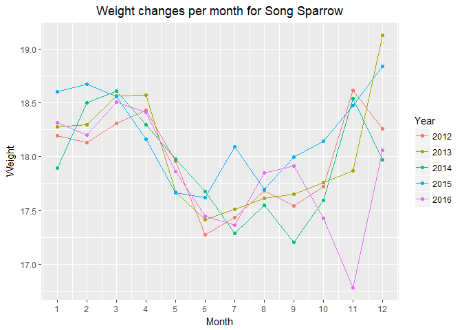

# Summary Document

This is the summary document by team DataKnights for our project of ‘Coyote Creek Field Station’. 

## Table of Contents:
This document includes the following,

* Our Audience and Analysis Target 
* Brief Description of the Dataset 
* Research Questions 
* Supporting Plots and Interpretations
* References

## Our Audience and Analysis Target: 

The target audience for our dataset can be the following, 

* People who aim to improve cohabitation between animals and humans.
* The scientists or research teams who want to work on making the data more useful to external people.
* Specialists in Biology, Ecology and environmental studies.
* Researchers who are willing to work on data visualizations and research on future analysis. 
* Environmental specialists who aim for better coexistence. 
* The data can be used by conservationists for spreading awareness and improving conservation. 
* The data can be made available to a broader audience who can help to enhance clarity, usability and perception of the visualized data. 
* The data can be to used to analyze bird migration patterns and this can become an important basis of evidence for future research on changes in the environment.

Having data of over a long period of time like this dataset, allows researchers to analyze the trends and patterns. Irregularities may alert the possible changes to migration patterns or the general health of each species. When changes are noticed, the investigation can be done by researchers on possible factors.

Every year people are observing the changing seasons. Each day, weather and climate influences billions of decisions around the world. A farmer’s livelihood may depend on having enough precipitation in the growing season. A poor prediction on a hurricane path may endanger the lives from communities that did not evacuate.

Thus, the complexity of our world should not be underestimated, especially when considering the intricacy of even the most fundamental biological systems and processes. Many factors and variables exist, and it’s a challenge to answer even simple climate questions without relying on certain assumptions or potentially unreliable predictive models. Using recent methods to collect, analyze, and visualize actual data, we can only help improve our understanding about these important climate and environmental questions. 

Such information can suggest changes in human activities to avoid harming certain environments with more actionable and targeted prevention strategies. Having reliable data with convincing analysis can provide important evidence that could have major impacts on public opinion and risk management.

With our analysis on this dataset, we only target to provide a better visualization and improved analysis. The aim is to make a change for the betterment of our society as well as for the preservation of the beautiful nature we have.

## Brief Description of the Dataset:
The dataset for team DataKnights is of the Coyote Creek Field Station (CCFS). The San Francisco Bay Bird Observatory is a non-profit bird conservation organization that currently operates the Coyote Creek Field Station (CCFS). The Coyote Creek Field Station is a banding station that operates year-round and was established in 1982. CCFS focuses on the various species of birds to make observations on the patterns of bird population, migration, breeding, wintering, etc. 

Bird banding is a technique used to identify various species of birds and keep a track of them. Bird banding helps in the study of birds and it is regulated by the U.S. federal government. Scientists put a colored band on the bird’s legs which represents a unique number. This helps to identify the bird and maintain a record of each. Colored bands also help them to differentiate the bird without catching them again. These bands are light-weight and cost efficient.

The Dataset of Coyote Creek Field Station (CCFS) consists of Bird Banding Data over the span of 20 years from 1996 to 2016. It comprises of information such as Banding Number, the different capture dates of the birds and various demographic details about the birds captured at the Coyote Creek Field Station. Banding number is a unique number given to each bird. The data consists a total of 78642 records. The total number of species of birds in the data set is 1154. Some of the important columns which we considered for our analysis are Band Number, Capture Date, First Capture Date, Last Capture Date, Capture Type, Species Code, Age, Sex, Fat, Wing Molt, Primary Wear, Wing Length and Weight.

We had the supporting metadata files to help us understand the various codes and fields within the dataset. The dataset included various information about various bird species. 
The metadata is as follows:
_Band Number_ - A unique number given to each bird when they are first captured. This helps to identify each bird uniquely.
_Capture Date_ - The date on which the bird was captured. First Captured Date and Last Captured Date gives the first and last capture date for the bird. Capture Type helps to identify if it is a newly captured bird or a returning bird. 
_Species Code_ - A unique code given to each species.
_Trap site_ - Data about the site in which the bird was captured.
_Age, Sex, Fat, Weight_ - Information on age, sex, fat stored in the furcular hollow of the bird’s body and weight is the mass of the bird in grams.
_Brood Patch and Cloacal Protuberance_ - Female and male breeding characteristics respectively. 
_Wing Molt_ - Used to identify the molting feathers in the wing and tail of the bird.
_Primary Wear_ - The amount of wear in the feather tips of the bird’s wing.
_Wing Length_ - The length of the wing of the bird when captured in millimeters.

## Research Questions: 
* How is Bird Banding Data Changing over time? Changes in the number of sightings?
*	Are the breeding and molting seasons changing?
*	Has the sex Ratio for birds changed significantly, and does it have a trend?
*	Has the number of birds seen each year been stable or trending in a certain direction?
*	Has been any change in the wing to weight ratio of the birds over past 20 years?
*	Finding the seasonal patterns in the weight changes in the birds.
*	Finding the seasonal patterns in Wing to Weight Ratio changes in birds.

As the data is given for a vast number of species, we will be focusing on five species that Coyote Creek Field Station abundantly have at their station. As suggested by the client, the species that are most common are, Song Sparrow (SOSP), Common Yellowthroat (COYE), Bewick's Wren (BEWR), Bushtit (BUSH) and Chestnut-backed Chickadee (CBCH). 

One aspect that we are trying to analyze is the weight of the species. Fat depends on the time of the year and weight also changes due to migration. This analysis will show if the patterns in the weight of these five species is consistent or varying. We will notice the changes in their wing to weight ratio. Apart from analyzing their weight changes for 20 years and by each month for 5 years, we will also study the trend in their sightings by month and year and the changes in their sex ratio.

## Supporting Plots and Interpretations:

### 1. Finding the seasonal patterns in the weight changes in the birds.

_Change in the average weight of each species by month over the span of 5 years:_

**Song Sparrow**: The pattern of changes in the weight per month is different for each species. It is fairly constant with a few outliers between 2012 to 2016. We can notice that there is a decrease in the average weight during the months of June to November and then an increase after that. But in 2016, there was a significant drop during the month of November. It seems like there is a decrease in the average species weight during summer time and an increase as winter comes around.

### 2. Has the number of birds seen each year been stable or trending in a certain direction?

_Number of Sightings of different species over the years:_

In this plot, it can be noticed that the number of sightings of Song Sparrows is significantly greater than the rest of the species but has dropped rapidly between 2010 and 2016. The sightings of Bewick's Wren have increased slowly. The sightings of Bushtit and Chestnut-backed Chickadee show slight increase and decrease in their number of sightings.  For Common Yellow Throat sightings, there was a visible fall and rise between 2005 and 2010.

### 3. Has the sex Ratio for birds changed significantly, and does it have a trend?

_Change in the Sex Ratio of Different species over the years:_

 
 
**Bushtit**: We can see in the plot that the number of Female birds is higher as compared to the number of Male birds in Bushtit species. It has not changed drastically in the last 20 years. We plotted this bar plot to compare the count of the species’ gender and see if there was any difference. Here, we can clearly see that the count of females has always been greater as compared to the males. May be the changes in temperatures during maturation can impact the sex of the offspring. However, since there are significant number of unknown values as well, we can draw an exact conclusion.

In this bar plot, we were given suggestions on increasing the gaps in between the bars to make it easier to read and understand. We have made that update here and in other similar bar plots for our final deliverable. 

### 4. How is Bird Banding Data Changing over time with respect to the changes in the number of sightings of a species?

_Number of Sightings of Song Sparrow by month over the span of 5 years:_

In the above plot, we performed an analysis for sightings of Song Sparrow per month for 5 years - 2012, 2013, 2014, 2015 and 2016. The x-axis depicts months in a year and the y-axis depicts the count for each month. We found a trend that the number of sightings for Song Sparrow and all the other species is significantly higher in the summer as compared to the winter seasons. We interpreted that, as birds avoid migrating in the cold seasons when there is a lack of food supply, they migrate mostly during the summer period. Thus, that is when the sightings of these bird species are comparatively and distinctively higher. 

In the plot, we can notice that the count is increasing after the month of April and is highest between May and June. The count starts declining towards the month of July and decreases gradually. In the earlier years, like in 2012 and 2013 there was a slight growth in the count during the months of August or September but in the recent years it has only declined. We are assuming the unusual climatic conditions and drastic environmental changes could be the cause of this decline in the latter years.

_Plots for other species can be found in the Final Markdown Document_

_There could be various possible questions on all these plots. We have listed them and tried to answer them to the best of our understanding and interpretation. They are the following,_ 

**_What was the reason for plotting the N/A's?_**

We had a lot of N/A values in our data and in some cases N/A values were more than the number of male birds. So, we thought it would not be a good idea to exclude them from the plot as it would be misleading.

**_In the plot for question 2, what was the reason for including the years that were excluded (1999 and 2002)?_**

The years 1999 and 2002 had a lot of missing data, so we decided to delete the data from those years during data cleaning. During plotting of the plot 2, we didn't include the data for 1999 and 2002. It was automatically inserted while joining 1998 to 2000 and 2001 to 2003. 

**_What was the issue with the Song Sparrow species from 2010-2016 as the count declined and it had a significant amount of weight loss as well?_**

We feel that the Song Sparrows' weight generally declines during migration and breeding periods. It is noticed that their weight generally increases during the winter period. We studied that Song Sparrows eat everything like plants, insects or seeds. The decline in their body weight in November 2016 is probably due to lack of food supply.

**Word Count:** The total word count for our summary document is 2021 words.

## References:
* San Francisco Bay Bird Observatory – Home, Retrieved December 04, 2018  from https://www.sfbbo.org/
*	Smithsonian’s National Zoo & Conservation Biology Institute, Retrieved December 05, 2018 from https://nationalzoo.si.edu/migratory-birds/what-bird-banding
*	Coyote Creek Field Station Land bird Banding Research – San Francisco Bay Bird Observatory, Retrieved December 05, 2018 from https://www.sfbbo.org/coyote-creek-field-station-landbird-banding-research.html

