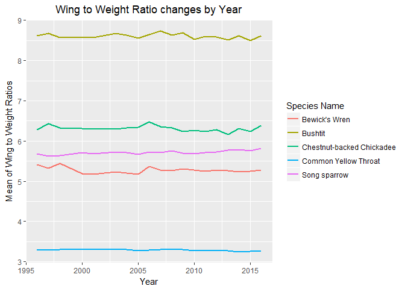

R Plots
================
Data Knights
November 7, 2018

-   [R Plots with Description](#r-plots-with-description)
    -   [Reading the Data File](#reading-the-data-file)
    -   [Change in the Sex Ratio of Different species over the years](#change-in-the-sex-ratio-of-different-species-over-the-years)
    -   [Number of Sightings of different species over the years](#number-of-sightings-of-different-species-over-the-years)
    -   [Number of Sightings of different Species by month over the span of 5 years](#number-of-sightings-of-different-species-by-month-over-the-span-of-5-years)
    -   [Change in the average weight of each species over the span of 20 years](#change-in-the-average-weight-of-each-species-over-the-span-of-20-years)
    -   [Change in the average weight of each species by month over the span of 5 years](#change-in-the-average-weight-of-each-species-by-month-over-the-span-of-5-years)
    -   [Change in the average Wing to Weight Ratio of each species over the span of 20 years](#change-in-the-average-wing-to-weight-ratio-of-each-species-over-the-span-of-20-years)
    -   [Change in the average Wing to Weight Ratio of each species by month over the span of 5 years](#change-in-the-average-wing-to-weight-ratio-of-each-species-by-month-over-the-span-of-5-years)

------------------------------------------------------------------------

R Plots with Description
------------------------

#### Reading the Data File

-   Read the data file. The file cleanData.csv is read and stored in a Dataframe called BandingData.

    ``` r
    BandingData <- read.csv("cleanData.csv", header = TRUE, stringsAsFactors = FALSE)
    ```

#### Change in the Sex Ratio of Different species over the years

-   Description here

    

#### Number of Sightings of different species over the years

-   Description here

    

#### Number of Sightings of different Species by month over the span of 5 years

-   Description here

    

#### Change in the average weight of each species over the span of 20 years

-   Description here

    

#### Change in the average weight of each species by month over the span of 5 years

-   Description here

    

#### Change in the average Wing to Weight Ratio of each species over the span of 20 years

-   Description here

    

#### Change in the average Wing to Weight Ratio of each species by month over the span of 5 years

-   Description here

    
