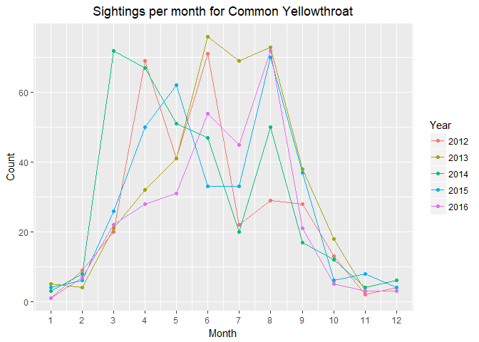
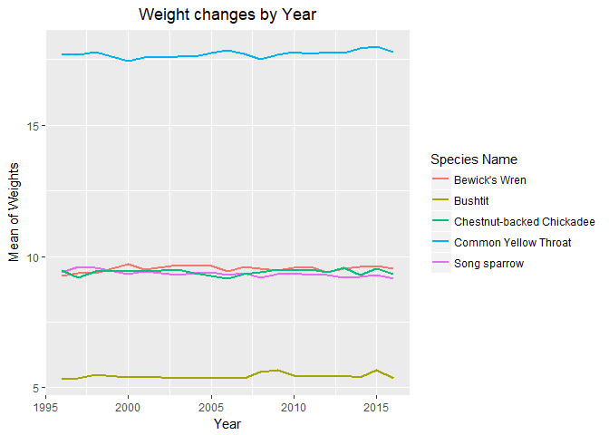
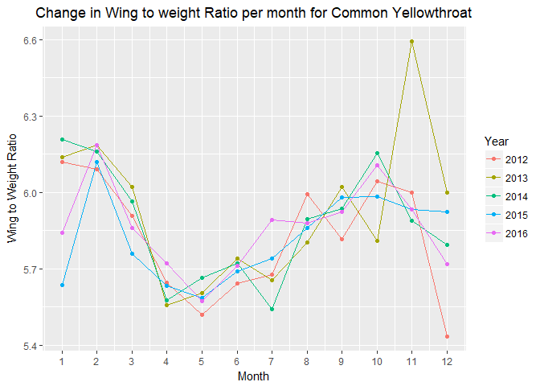

R Plots
================
Data Knights
November 7, 2018

-   [R Plots with Description](#r-plots-with-description)
    -   [Research Questions](#research-questions)
    -   [Reading the Data File](#reading-the-data-file)
    -   [Change in the Sex Ratio of Different species over the years](#change-in-the-sex-ratio-of-different-species-over-the-years)
    -   [Number of Sightings of different species over the years](#number-of-sightings-of-different-species-over-the-years)
    -   [Number of Sightings of different Species by month over the span of 5 years](#number-of-sightings-of-different-species-by-month-over-the-span-of-5-years)
    -   [Change in the average weight of each species over the span of 20 years](#change-in-the-average-weight-of-each-species-over-the-span-of-20-years)
    -   [Change in the average weight of each species by month over the span of 5 years](#change-in-the-average-weight-of-each-species-by-month-over-the-span-of-5-years)
    -   [Change in the average Wing to Weight Ratio of each species over the span of 20 years](#change-in-the-average-wing-to-weight-ratio-of-each-species-over-the-span-of-20-years)
    -   [Change in the average Wing to Weight Ratio of each species by month over the span of 5 years](#change-in-the-average-wing-to-weight-ratio-of-each-species-by-month-over-the-span-of-5-years)
-   [Contributorship Statement](#contributorship-statement)
-   [Proofreader](#proofreader)

------------------------------------------------------------------------

R Plots with Description
------------------------

#### Research Questions

-   How is Bird Banding Data Changing over time? (Changes in the number of sightings)
-   Are the breeding and molting seasons changing?
-   Has the sex Ratio for birds changed significantly, and does it have a trend?
-   Has the number of birds seen each year been stable or trending in a certain direction?
-   Has been any change in the wing to weight ratio of the birds over past 20 years?
-   Finding the seasonal patterns in the weight changes in the birds.
-   Finding the seasonal patterns in Wing to Weight Ratio changes in birds.

#### Reading the Data File

-   Read the data file. The file cleanData.csv is read and stored in a Dataframe called BandingData.

    ``` r
    BandingData <- read.csv("cleanData.csv", header = TRUE, stringsAsFactors = FALSE)
    ```

#### Change in the Sex Ratio of Different species over the years

-   **Song Sparrow**: We cannot quite comment on the Sex Ratio of Song Sparrows as there are a lot of NA values, which means the sex of the bird was not determined at the time of capture. However, we can see that population of male birds is higher that female birds for majority of the years.

    

-   **Common Yellowthroat**: The number of Male birds is significantly higher than that of Female birds and is being constant over the years.

    

-   **Bewick's Wren**: Cannot identify trends as more than 90% of the data is unknown.

    

-   **Bushtit**: The number of Female birds is higher compare to the number of Male birds and has not changed in 20 years.

    

-   **Chestnut-backed Chickadee**: Cannot identify trends as more than 90% of the data is unknown.

    

#### Number of Sightings of different species over the years

-   It can be noticed that the number of sightings of Song sparrows is significantly higher than that of other species but has dropped rapidly between 2010 and 2016 which might be a reason to be concerned. The sightings of Bewick's Wren is increasing slowly while the other three species are fairly constant.

    

#### Number of Sightings of different Species by month over the span of 5 years

-   After analyzing these plots, we found a trend that number of sightings is significantly higher in the summer than compared to the cold seasons for all the species.

    

#### Change in the average weight of each species over the span of 20 years

-   The average weight of all the species is constant over the past 20 years.

    

#### Change in the average weight of each species by month over the span of 5 years

-   The pattern of changes in the weight per month is different for each species, but is fairly constant with a few outliers between 2012 to 2016

    

#### Change in the average Wing to Weight Ratio of each species over the span of 20 years

-   The average wing to weight ratio of all the species is constant over the past 20 years.

    

#### Change in the average Wing to Weight Ratio of each species by month over the span of 5 years

-   The pattern of changes in the wing to weight ratio per month is different for each species, but is fairly constant with a few outliers between 2012 to 2016

    

Contributorship Statement
-------------------------
The contributions made to this assignment include plotting in different ways to answer the research questions graphically. The dataset was analyzed in various aspects using R scripts in the previous assignment and is further justified using R plots on the same. We agree to be held responsible for all the work done on this dataset. 

The species that we focussed on included - Song Sparrow, Common Yellowthroat, Bewick's Wren, Bushtit and Chestnut-backed Chickadee. Vineeth Reddy and Aishwarya Reddy discussed various ways in which the data can be analyzed visually. Selection of colors is an important part of R plots so the colors for the plots were selected to make it easier to read. It was also made sure that the data in the plots, scale values as well as on the axes were clear. Plotting was done to determine change in the sex ratio of different species over the years, number of sightings of different species over the years, number of sightings of different species by month over the span of 5 years, change in the average weight of each species over the span of 20 years, change in the average weight of each species by month over the span of 5 years, change in the average Wing to Weight ratio of each species over the span of 20 years and change in the average Wing to Weight ratio of each species by month over the span of 5 years.

After we planned how to work on this assignment, Vineeth Reddy plotted majority of the graphs as they were similar for every species. The contributorship statement and proofreading was done by Aishwarya Reddy. Aishwarya Reddy will also post the research questions, its respective plot and interpretation to the peer review discussion thread as mentioned in the second part of this assignment. 

Proofreader
-----------
* The document was proofread by Aishwarya Reddy. 
